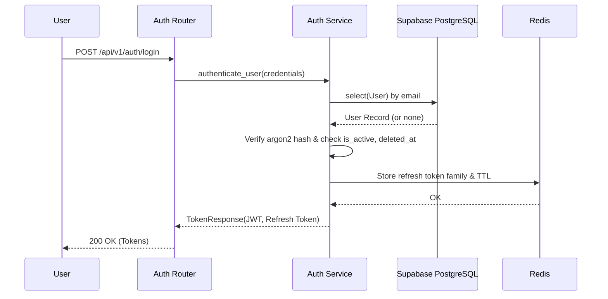

# Authentication Implementation Report

## Architecture
The authentication system is built on a **Modular Monolith** architecture utilizing FastAPI, Supabase PostgreSQL, and Redis. It provides a robust, state-of-the-art token-based authentication system with strict replay detection, family revocation, and seamless RBAC.

### Flow Diagrams

## API Endpoints
- `POST /api/v1/auth/register`: Create a new user with secure password hashing.
- `POST /api/v1/auth/login`: Authenticate and issue JWT + Refresh Token pairs.
- `POST /api/v1/auth/refresh`: Rotate refresh token and issue new JWT, with replay detection.
- `POST /api/v1/auth/logout`: Invalidate a specific refresh token family in Redis.
- `GET /api/v1/users/me`: Protected endpoint to fetch the current user profile.

## JWT Lifecycle
- **Algorithm**: HS256
- **Expiration**: 15 minutes
- **Claims**: `sub` (User ID), `roles` (List of strings), `jti` (unique token ID), and optionally `business_id`.
- **Validation**: Enforced via `HTTPBearer` in `get_current_user` dependency. 

## Refresh Lifecycle & Redis Structure
- **Expiration**: 30 days.
- **Structure**:
  - `auth:family:{family_id}`: Hash storing the active `token` and `user_id`.
  - `auth:user:{user_id}:families`: Set tracking all active families for a user, allowing global revocation.
- **Replay Protection**: If a previously used refresh token is presented, the system instantly detects the token reuse, deletes the entire family from Redis, and throws a `401 Unauthorized`. This burns all tokens compromised by the attacker.

## Security Decisions
1. **Password Hashing**: Argon2id via `passlib`.
2. **Replay Detection**: Redis-backed token families.
3. **No Mocks**: Directly integrated with Supabase and Redis.
4. **Exception Handling**: Global exception handlers prevent `DomainException`s from surfacing as `500 Internal Server Error`, mapping them securely to `401` or `403`.
5. **Soft Deletion & Disable**: Explicitly checked at the service layer for `login` and `refresh`.

## Known Limitations
- Rate limiting is not yet applied to the `/login` endpoint (planned for infrastructure layer).
- MFA (Multi-Factor Authentication) fields exist in the database but are not yet exposed via the API.
