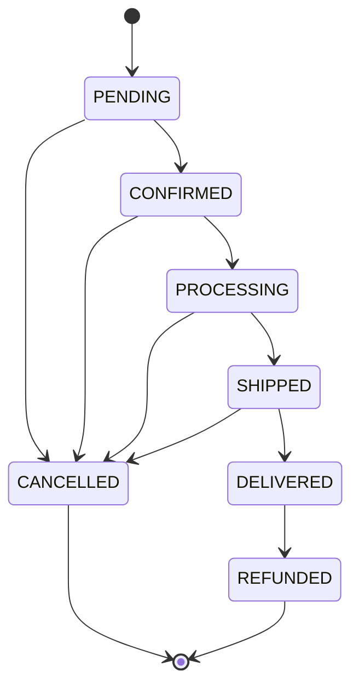

# Orders Module Implementation Report

**Date:** 2026-08-09  
**Module:** Orders (`apps/api/modules/orders`)  
**Status:** ✅ **Production Ready** (40/40 Verification Assertions Passed against Live Supabase)  
**Architecture:** Modular Monolith with `AsyncSession`, Repository Pattern, Service Layer, and Row Level Security (RLS).

---

## 1. Executive Summary

The **Orders Module** delivers full order processing, state management, price resolution, and tenant isolation for the EMIVO SaaS eCommerce platform. It replaces legacy raw SQL queries with a strict async SQLAlchemy ORM repository pattern. All monetary amounts are stored in minor units (integer cents/paise) to prevent floating-point precision errors.

Key features include:
- **Automatic Price Resolution**: Unit prices are derived directly from active `Product` or `ProductVariant` database models.
- **Idempotency Deduplication**: Safe re-submissions using client-provided or generated `idempotency_key` strings.
- **Strict Status Transition Matrix**: Enforces valid lifecycle states (`PENDING` -> `CONFIRMED` -> `PROCESSING` -> `SHIPPED` -> `DELIVERED` -> `REFUNDED` / `CANCELLED`).
- **RLS Tenant Isolation**: DB-level policy (`FORCE ROW LEVEL SECURITY`) with `emivo_app` role enforcing `app.business_id` scope.
- **Eager Loading**: `lazy="selectin"` relationship on `Order.items` to eliminate async SQLAlchemy greenlet issues.
- **Soft Delete Support**: `SoftDeleteMixin` integration marking `deleted_at` and auto-transitioning unfulfilled orders to `CANCELLED`.

---

## 2. Database Schema

The Orders module comprises two relational tables: `public.orders` and `public.order_items`.

### `public.orders` Table
Implemented in [`apps/api/modules/orders/models.py`](file:///d:/Projects/EMIVO/apps/api/modules/orders/models.py#L22-L63).

| Column Name | Data Type | Constraints | Description |
|---|---|---|---|
| `id` | `VARCHAR(36)` | `PRIMARY KEY` | UUID primary key |
| `user_id` | `VARCHAR(36)` | `NOT NULL`, `FK(users.id)`, `INDEX` | Account creator / creator ID |
| `customer_id` | `VARCHAR(36)` | `NULLABLE`, `FK(customers.id)`, `INDEX` | Customer entity attached to order |
| `business_id` | `VARCHAR(36)` | `NOT NULL`, `FK(businesses.id)`, `INDEX` | Tenant identifier for RLS isolation |
| `status` | `VARCHAR(50)` | `NOT NULL`, `INDEX`, Enum | Lifecycle status (`OrderStatus` enum) |
| `idempotency_key` | `VARCHAR(255)` | `NOT NULL`, `UNIQUE`, `INDEX` | Deduplication key |
| `subtotal` | `INTEGER` | `NOT NULL`, Default `0` | Sum of item subtotals in minor units |
| `tax_total` | `INTEGER` | `NOT NULL`, Default `0` | Total tax amount in minor units |
| `shipping_total` | `INTEGER` | `NOT NULL`, Default `0` | Shipping charges in minor units |
| `discount_total` | `INTEGER` | `NOT NULL`, Default `0` | Total discounts applied in minor units |
| `total` | `INTEGER` | `NOT NULL`, Default `0` | Net order total in minor units |
| `currency` | `VARCHAR(3)` | `NOT NULL`, Default `'INR'` | ISO 4217 currency code |
| `shipping_address` | `JSONB` | `NOT NULL` | Structured shipping address object |
| `billing_address` | `JSONB` | `NULLABLE` | Structured billing address object |
| `notes` | `TEXT` | `NULLABLE` | Optional order/customer notes |
| `metadata_info` | `JSONB` | `NULLABLE` | Dynamic metadata & transition reasons |
| `created_at` | `TIMESTAMPTZ` | `NOT NULL` | Creation timestamp |
| `updated_at` | `TIMESTAMPTZ` | `NOT NULL` | Last update timestamp |
| `deleted_at` | `TIMESTAMPTZ` | `NULLABLE` | Soft deletion timestamp |

### `public.order_items` Table
Implemented in [`apps/api/modules/orders/models.py`](file:///d:/Projects/EMIVO/apps/api/modules/orders/models.py#L65-L93).

| Column Name | Data Type | Constraints | Description |
|---|---|---|---|
| `id` | `VARCHAR(36)` | `PRIMARY KEY` | UUID primary key |
| `order_id` | `VARCHAR(36)` | `NOT NULL`, `FK(orders.id)`, `INDEX` | Parent order reference |
| `product_id` | `VARCHAR(36)` | `NOT NULL`, `FK(products.id)` | Product reference |
| `variant_id` | `VARCHAR(36)` | `NULLABLE`, `FK(product_variants.id)` | Product variant reference |
| `quantity` | `INTEGER` | `NOT NULL` | Item quantity ordered |
| `unit_price` | `INTEGER` | `NOT NULL` | Historical snapshot unit price (minor units) |
| `subtotal` | `INTEGER` | `NOT NULL` | `unit_price * quantity` |
| `tax` | `INTEGER` | `NOT NULL`, Default `0` | Item tax in minor units |
| `total` | `INTEGER` | `NOT NULL` | Item total after tax |
| `product_name` | `VARCHAR(255)` | `NOT NULL` | Snapshot product name |
| `variant_name` | `VARCHAR(255)` | `NULLABLE` | Snapshot variant name |
| `created_at` | `TIMESTAMPTZ` | `NOT NULL` | Creation timestamp |
| `updated_at` | `TIMESTAMPTZ` | `NOT NULL` | Last update timestamp |

---

## 3. API Endpoints

All endpoints reside in [`apps/api/modules/orders/router.py`](file:///d:/Projects/EMIVO/apps/api/modules/orders/router.py) under the `/api/v1/orders` prefix and require JWT authorization (`require_roles`).

| Method | Endpoint Path | Required Roles | Description |
|---|---|---|---|
| `POST` | `/api/v1/orders/` | `platform_admin`, `owner`, `staff` | Create a new order with automatic price lookup |
| `GET` | `/api/v1/orders/` | `platform_admin`, `owner`, `staff` | Paginated list with filtering by `status` or `customer_id` |
| `GET` | `/api/v1/orders/{id}` | `platform_admin`, `owner`, `staff` | Get single order by ID with eager-loaded line items |
| `PATCH` | `/api/v1/orders/{id}/status` | `platform_admin`, `owner`, `staff` | State-validated order status transition |
| `DELETE` | `/api/v1/orders/{id}` | `platform_admin`, `owner` | Soft delete order (sets `deleted_at` & `CANCELLED`) |

---

## 4. Request & Response Examples

### 4.1 Create Order (`POST /api/v1/orders/`)

**Request Payload:**
```json
{
  "customer_id": "c1f7a2b0-4e2a-4a55-b102-123456789abc",
  "idempotency_key": "idemp_20260809_001",
  "shipping_address": {
    "name": "John Doe",
    "street": "123 Commerce St",
    "city": "Tech City",
    "state": "CA",
    "postal_code": "90210",
    "country": "US",
    "phone": "+1-555-0199"
  },
  "billing_address": {
    "name": "John Doe",
    "street": "123 Commerce St",
    "city": "Tech City",
    "state": "CA",
    "postal_code": "90210",
    "country": "US"
  },
  "items": [
    {
      "product_id": "8a39b2e1-7c4d-4e99-8811-aabbccdd1122",
      "variant_id": "9b40c3f2-8d5e-4f00-9922-bbccddeeff33",
      "quantity": 2
    }
  ],
  "notes": "Fragile — handle with care",
  "metadata_info": { "source": "web_storefront" }
}
```

**Response (201 Created):**
```json
{
  "id": "e5510f22-1234-4bc1-9e22-998877665544",
  "user_id": "u9911223-3344-5566-7788-99aabbccdd00",
  "customer_id": "c1f7a2b0-4e2a-4a55-b102-123456789abc",
  "business_id": "b0011223-3344-5566-7788-99aabbccdd00",
  "status": "PENDING",
  "idempotency_key": "idemp_20260809_001",
  "subtotal": 270000,
  "tax_total": 0,
  "shipping_total": 0,
  "discount_total": 0,
  "total": 270000,
  "currency": "INR",
  "shipping_address": {
    "name": "John Doe",
    "street": "123 Commerce St",
    "city": "Tech City",
    "state": "CA",
    "postal_code": "90210",
    "country": "US",
    "phone": "+1-555-0199"
  },
  "billing_address": {
    "name": "John Doe",
    "street": "123 Commerce St",
    "city": "Tech City",
    "state": "CA",
    "postal_code": "90210",
    "country": "US"
  },
  "notes": "Fragile — handle with care",
  "metadata_info": { "source": "web_storefront" },
  "created_at": "2026-08-09T18:45:00Z",
  "updated_at": "2026-08-09T18:45:00Z",
  "items": [
    {
      "id": "item-11223344-5566-7788-9900-aabbccdd",
      "product_id": "8a39b2e1-7c4d-4e99-8811-aabbccdd1122",
      "variant_id": "9b40c3f2-8d5e-4f00-9922-bbccddeeff33",
      "quantity": 2,
      "unit_price": 135000,
      "subtotal": 270000,
      "tax": 0,
      "total": 270000,
      "product_name": "Gaming Laptop",
      "variant_name": "16GB RAM / 1TB SSD",
      "created_at": "2026-08-09T18:45:00Z"
    }
  ]
}
```

---

### 4.2 Status Transition (`PATCH /api/v1/orders/{id}/status`)

**Request Payload:**
```json
{
  "status": "CONFIRMED",
  "reason": "Payment successfully processed"
}
```

**Response (200 OK):**
```json
{
  "id": "e5510f22-1234-4bc1-9e22-998877665544",
  "status": "CONFIRMED",
  "metadata_info": {
    "source": "web_storefront",
    "status_reason": "Payment successfully processed",
    "status_updated_at": "2026-08-09T18:46:12Z"
  }
}
```

---

## 5. RLS Tenant Isolation Mechanics

Tenant isolation is enforced directly within PostgreSQL using **Row Level Security (RLS)** policies defined in [`db/rls/03_orders.sql`](file:///d:/Projects/EMIVO/db/rls/03_orders.sql).

### Application Security Pattern:
1. **DB Context Injection**: Requests invoke [`set_db_context`](file:///d:/Projects/EMIVO/apps/api/core/dependencies.py) dependency.
2. **Session Variable & Role**:
   - `SET LOCAL ROLE emivo_app;` (Switch from superuser to unprivileged app role with `NOBYPASSRLS`).
   - `SET LOCAL app.business_id = '<business_id>';` (Set session scope).
3. **RLS Policies**:
   - `orders`:
     ```sql
     CREATE POLICY "Tenant isolation for orders" ON public.orders
     FOR ALL USING (business_id = NULLIF(current_setting('app.business_id', true), '')::text);
     ```
   - `order_items`:
     ```sql
     CREATE POLICY "Tenant isolation for order_items" ON public.order_items
     FOR ALL USING (EXISTS (
         SELECT 1 FROM public.orders o
         WHERE o.id = order_id
         AND o.business_id = NULLIF(current_setting('app.business_id', true), '')::text
     ));
     ```
   - Forced via `ALTER TABLE public.orders FORCE ROW LEVEL SECURITY;`.

Cross-tenant access attempts by Business B on Business A orders return `404 Not Found` (or `403 Forbidden`).

---

## 6. Business & Validation Rules

### 6.1 Automatic Price Resolution
Clients submit item IDs and quantities (`product_id`, `variant_id`, `quantity`). The [`OrderService.create_order`](file:///d:/Projects/EMIVO/apps/api/modules/orders/service.py#L53) resolves unit prices directly from backend database records (`ProductRepository`):
- If `variant_id` is supplied, `unit_price` = `variant.price` and `variant_name` = `variant.name`.
- If `variant_id` is `None`, `unit_price` = `product.price`.
- Subtotal is automatically computed as `unit_price * quantity`.

### 6.2 Idempotency Deduplication
If `idempotency_key` is provided in the `OrderCreate` payload, [`OrderRepository.get_by_idempotency_key`](file:///d:/Projects/EMIVO/apps/api/modules/orders/repository.py#L30) checks for an existing non-deleted order. If found, the existing order object is returned immediately without creating a duplicate record.

### 6.3 State Transition Matrix
Enforced by [`VALID_TRANSITIONS`](file:///d:/Projects/EMIVO/apps/api/modules/orders/service.py#L22):



Attempting an invalid transition (e.g. `PROCESSING` -> `PENDING`) raises a `DomainException` with HTTP status `400 Bad Request`.

### 6.4 Soft Delete / Cancellation
`DELETE /api/v1/orders/{id}` performs soft deletion:
- Sets `deleted_at` timestamp.
- Switches status to `CANCELLED` if order was not already `CANCELLED` or `REFUNDED`.
- Excludes the record from all standard queries via `Order.deleted_at.is_(None)`.

---

## 7. Database Migration

The migration adding `customer_id` and `notes` to `orders` was executed cleanly:
- **Migration File**: [`db/migrations/versions/20260809_1842_266616b0d24c_add_customer_id_and_notes_to_orders.py`](file:///d:/Projects/EMIVO/db/migrations/versions/20260809_1842_266616b0d24c_add_customer_id_and_notes_to_orders.py)
- **Revision ID**: `266616b0d24c` (revises `bf1f48d88adb`)

---

## 8. Verification Results

The module was verified using [`verify/orders/verify_orders.py`](file:///d:/Projects/EMIVO/verify/orders/verify_orders.py) against live Supabase infrastructure.

### Suite Summary:
- **Total Assertions Executed**: 40
- **Passed Assertions**: 40
- **Failed Assertions**: 0
- **Full Regression Status**: 4/4 core suites green (`Auth`, `Products`, `Customers`, `Orders`).

### Assertion Breakdown:
1. ✅ Business A Owner RBAC & Token generation
2. ✅ Business B Owner RBAC & Token generation
3. ✅ Setup Customer and Product with Variant in Business A
4. ✅ Create Order (201 Created) — validates customer_id, notes, unit_price resolution (135000), item subtotal (270000), total (270000)
5. ✅ Idempotency Key Re-submission — returns duplicate order without re-insertion
6. ✅ Get Order by ID (200 OK) — eager loads items, missing ID returns 404
7. ✅ List Orders with Pagination & Filters (`status=PENDING`, `customer_id`)
8. ✅ Order Status Transitions: `PENDING` -> `CONFIRMED` -> `PROCESSING`
9. ✅ Invalid Status Transition (`PROCESSING` -> `PENDING`) rejected with HTTP 400
10. ✅ RLS Isolation: Business B receives 404 accessing Business A order; Business B order excluded from Business A list
11. ✅ Soft Delete / Cancel Order (HTTP 204) — sets `deleted_at`, excludes from GET and List operations
12. ✅ Unauthorized access without token / with invalid token rejected (401/403)

---

## 9. Bugs Fixed During Development

1. **Legacy Raw SQL Bypass**: Replaced raw SQL execution in router with `AsyncSession` ORM Repository & Service layer.
2. **Missing `customer_id` and `notes` Columns**: Generated Alembic migration `266616b0d24c` to align database schema with models.
3. **Pydantic Serialization (`MissingGreenlet`)**: Added `lazy="selectin"` on `Order.items` ORM relationship to support seamless async serialization.
4. **Hardcoded Pricing**: Replaced static service mock with dynamic DB price lookup across `Product` and `ProductVariant` models.
