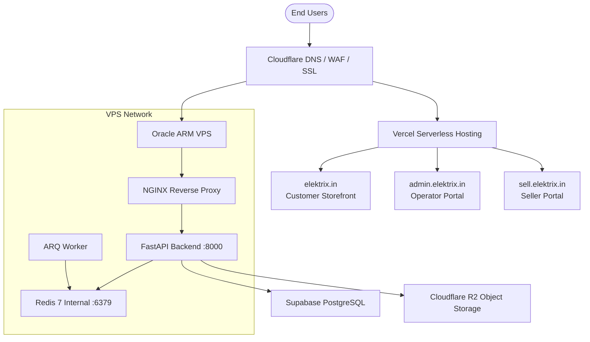

# ELEKTRIX — Production Architecture

This document describes the canonical production architecture for the **ELEKTRIX** platform. 

**Official Domain:** https://elektrix.in  
**Product Brand:** ELEKTRIX  

---

## 1. High-Level Topology

ELEKTRIX adopts a hybrid topology where the frontends are distributed globally on Vercel's Edge network, while the stateful API and background workers are consolidated on an Oracle ARM VPS. Database and Object Storage utilize serverless cloud infrastructure.

---

## 2. Tier Breakdown

### A. Edge / Security Tier (Cloudflare)
All traffic destined for `elektrix.in` (and its subdomains) passes through Cloudflare.
- **DNS Hosting:** Cloudflare manages authoritative zones.
- **WAF:** Configured with core rules to reject SQL injection, cross-site scripting (XSS), and automated scanners.
- **SSL/TLS Mode:** **Full (Strict)**. Nginx on the VPS terminates SSL using Certificates generated by Let's Encrypt.
- **Proxy Status:** 
  - `elektrix.in`, `admin.elektrix.in`, `sell.elektrix.in` → **Proxied (Orange Cloud)**.
  - `api.elektrix.in` → **Proxied (Orange Cloud)**, utilizing specific rate limits and firewall bypass rules for authenticated clients.

### B. Frontend Tier (Vercel)
All three user-facing frontends are hosted on Vercel:
1. **Customer Storefront (`elektrix.in` / `www.elektrix.in`):** Public-facing e-commerce UI built on Next.js 15. Responsive design based on the approved premium DEMO storefront aesthetic.
2. **Platform Admin Portal (`admin.elektrix.in`):** Internal administrative panel for platform owners and operations staff. Polished using the ELEKTRIX light theme design language.
3. **Business/Seller Portal (`sell.elektrix.in`):** Future dedicated workspace for sellers to manage inventory, fulfill orders, and inspect earnings. *Note: Core seller logic is mapped in the architecture; mock screens are strictly forbidden.*

### C. Backend Tier (Oracle ARM VPS)
The Oracle ARM VPS runs Linux (Ubuntu Server) and orchestrates containerized services via `compose.prod.vm1.yaml`:
- **NGINX:** Listens on public ports `80` and `443` to terminate SSL, filter traffic, enforce security headers, and proxy requests to internal Docker networks.
- **FastAPI (`api`):** Dual instances run in replication mode. Connects dynamically to Supabase and Redis.
- **Redis (`redis`):** Running privately on the internal Docker network. Manages refresh token family tracking, rate limiting, and ARQ queue state.
- **ARQ Worker (`workers`):** Processes background tasks (email dispatch, statistics pre-calculation, invoice generation).

### D. Storage & Cloud Services Tier
- **Supabase PostgreSQL:** Managed relational database. Enforces Row Level Security (RLS) policies based on tenant business context (`app.business_id`) and role memberships (`app.user_id`).
- **Cloudflare R2:** High-performance, S3-compatible object storage container (`emivo-media` bucket) for hosting product images and business assets.

---

## 3. Communication Flows

1. **Static Content:** Storefront and portal assets are served directly from the Vercel Edge Cache.
2. **Dynamic Operations:** The frontend applications make API requests to `https://api.elektrix.in/api/v1` using cookie-based JWT authentication.
3. **Database Operations:** The FastAPI backend connects to Supabase via pooled TCP connections using `asyncpg` for high-throughput concurrency. RLS is enforced at the PostgreSQL session level by executing `SET LOCAL ROLE emivo_app` on checkout.
