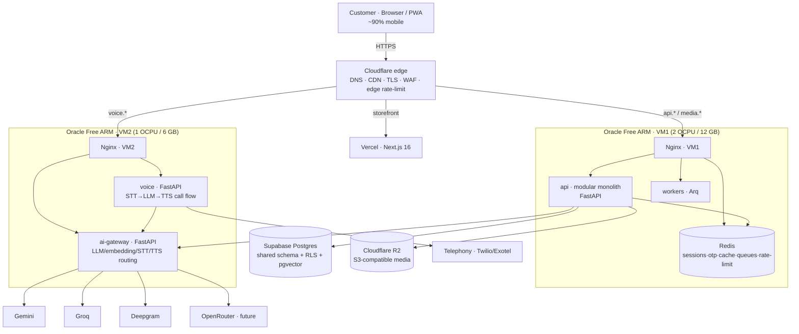

# 00 — Executive Overview & Decision Log

## What we are building

| Layer | Choice | Runs where |
|-------|--------|------------|
| Storefront | Next.js 16 (already built) | Vercel |
| Core API | **Modular monolith** — FastAPI, one process, isolated modules | VM1 (2 OCPU / 12 GB) |
| Workers | Arq (async, Redis-backed) — emails, notifications, indexing, reports | VM1 |
| Cache / queues / sessions / OTP / rate-limit | Redis | VM1 |
| AI Gateway + Voice | Separate services | VM2 (1 OCPU / 6 GB) |
| Database | Supabase Postgres (shared schema + RLS, multi-tenant) | Supabase (managed) |
| Vector store | pgvector now → Qdrant behind an interface later | Supabase → VM2/VM3 |
| Object storage | Cloudflare R2 (S3-compatible) + Oracle Object Storage + external URLs | Cloudflare / OCI |
| Edge | Cloudflare free (DNS, CDN, TLS, WAF, edge rate-limit) | Cloudflare |
| Reverse proxy | Nginx on each VM | VM1, VM2 |
| CI/CD | GitHub Actions → GHCR → SSH deploy | GitHub |

**Cost at MVP: ~ ₹0/month infrastructure** (two free Oracle VMs, Supabase free,
R2 free, Cloudflare free, Vercel Hobby, AI paid per-token). The only unavoidable
spend is AI usage and the domain.

---

## Critical review — decisions I challenged

An architect's job is to argue with the brief. These are the places where the brief
as written would cost you money, memory, or a future rewrite, and what I recommend
instead.

### 1. "We do NOT want a monolith" → you want a *modular* monolith (approved)

A monolith is not defined by "one process". It is defined by *coupling*: a big ball
of mud where modules import each other and share one mutable core. Sixteen separate
containers on 2 free ARM VMs at "few hundred concurrent users" is an **anti-pattern**:

- Each FastAPI service needs ~300–600 MB + uvicorn workers → 16 services blow the
  memory budget of both VMs combined.
- You inherit per-service networking, config, logging, health, and deploy tooling
  before you have any revenue.
- Cross-service calls over HTTP at MVP scale add latency and failure modes for zero
  user value.

The design instead isolates modules **in code and in contracts, not in processes**:
each module owns its tables, exposes only its schemas/DTOs, and talks to other
modules **only via domain events on a transactional outbox → Redis Streams**. Because
the contract between modules is an event stream (not a Python import), lifting a
module into its own container later is a **deployment change, not a rewrite**. This
is exactly the "microservices without rewriting" property you asked for — the same
code, the same events, just a different process boundary.

**Why not a true monolith then?** The modular form adds real, permanent structure —
module-boundary tests (import-linter), an event catalog, versioned contracts — that
a loose monolith lacks, and that make the later split mechanical.

**Trade-off:** slightly more ceremony than a quick-and-dirty monolith (you must route
cross-module work through events, not direct calls). You pay this now, you earn it
back at the split.

**Migration path:** `10-roadmap.md` Phase 3 — each module's router/service/repository
moves into its own container; the outbox publisher switches Redis Streams → Redpanda;
handlers move to consumers. Zero business-logic edits.

### 2. Qdrant now → pgvector first, Qdrant behind an interface later (approved)

Qdrant wants 1–2 GB resident and its own backup story. At 500 products and few
hundred concurrent users, semantic search is a rounding error for Postgres `pgvector`
— which you already have for free inside Supabase. Both use the same embedding model,
so the search module defines a `VectorStore` interface
(`upsert()`, `query()`), with a Postgres implementation today and a Qdrant
implementation when you exceed ~1M vectors or need Qdrant's filtered hybrid search
at scale. Provider selection is a config value.

**Trade-off:** pgvector's filtering/scoring is less powerful than Qdrant's at very
large scale; Qdrant's disk index is more memory-efficient past a few million vectors.
Neither matters at MVP.

### 3. "Multiple compose files (dev/test/prod)" → base file + overlays

Maintaining three parallel compose files drifts them apart. Use one `compose.yaml`
(base topology) + thin `compose.{dev,test,prod}.yaml` overlays. Same services, env-
driven differences. Less duplication, fewer "works in dev, not prod" bugs.

### 4. "Redis for everything" → yes, but with a discipline

Redis on the same 12 GB VM is fine, but:
- **Queues must be backed by the DB first** (transactional outbox), not enqueued
  straight into Redis — otherwise a Redis flush loses business events.
- Give Redis a **memory cap** (`maxmemory`) + eviction policy; use `noeviction` for
  keys you can't afford to lose, `allkeys-lru` for cache.
- Persistence: RDB snapshot to disk + ship snapshots to R2 nightly. Sessions/OTP can
  be lost on restart with acceptable impact; cache loss is fine.

### 5. Images from GitHub raw → move to R2 behind Cloudflare (today)

The storefront currently serves product images from `raw.githubusercontent.com`.
That is a git repo doing CDN work — no cache headers you control, no lifecycle, rate
limits, and it couples your catalog to your git history. Your brief already says R2;
this makes it a **day-1 quick win**: upload the existing `public/images/*` to R2,
serve via Cloudflare, keep the same `` shape.

### 6. Nginx alone → put Cloudflare in front first

Cloudflare free gives you DNS, CDN caching of media, TLS termination, DDoS
absorption, bot management, and **edge rate-limiting** — for ₹0. Nginx still does
origin reverse-proxying, compression, security headers, and origin-side rate
limiting. Defense at two layers; nginx stays as your origin for when you leave
Cloudflare.

### 7. Supabase is your Postgres, and it is a *trap at scale* — plan the exit

Supabase free: 500 MB DB, project **pauses after 7 days of inactivity**, no replicas,
no PITR. Fine for MVP. But "millions of products" will outgrow it, and the pause is a
production risk. Two rules make the exit painless:
- **Write plain-Postgres SQL.** No Supabase-specific features that lock you (auth via
  GoTrue, storage, Realtime are *not* used — you bring your own auth and storage).
- Keep a path to Neon / self-hosted Postgres (same driver, same SQL) — `04-database-design.md`.

### 8. Soft deletes everywhere → targeted soft deletes

`deleted_at` on every table breaks unique constraints (SKU reuse), bloats indexes,
and forces every query to filter it. Soft-delete only what you must (users,
businesses, products, orders — audit/legal). **Hard-delete** transient data (carts,
OTPs, sessions, processed outbox rows). Use partial unique indexes
(`WHERE deleted_at IS NULL`) to keep unique keys workable.

### 9. Celery → Arq

Celery is the default answer and it's the wrong default for an async FastAPI app: it
is sync-first, heavyweight, and its event loop story with `asyncio` is awkward. **Arq**
is async-native, Redis-backed, tiny, and does cron + retries + dead-letter out of the
box. Same abstraction either way — the worker entrypoint (`run.py` + registered
tasks) is what a future queue (SQS/Redpanda) replaces.

### 10. "Modular folders" is not enough — enforce it with a test

You can't rely on team discipline to keep modules isolated. Add **import-linter** as
a CI gate: no module may import another module's internals; the only allowed shared
surface is `core/` and `common/`. The test fails the build when someone couples
modules. This is what makes the microservice split *actual*, not aspirational.

### 11. One network model: shared-schema + RLS, not schema-per-tenant

`schema_per_tenant` / `database_per_tenant` are heavy and make cross-tenant queries
(recommendations, analytics) painful. Standard multi-tenant B2B SaaS uses a **shared
schema, `business_id` on every tenant table, composite indexes on
`(business_id, ...)`, and Postgres RLS** as defense-in-depth. Sharding later = Citus
distributed tables by `business_id`, or moving big tenants to dedicated schemas.

### 12. Don't let the backend fetch arbitrary image URLs (SSRF)

Your product `image_url` can point anywhere — including `http://169.254.169.254`
(cloud metadata) or an internal service. If any code ever fetches those URLs (image
proxy, "import product image"), add SSRF guards: allow-list schemes/hosts, block
private/link-local ranges, never follow to internal IPs. See `07-security-and-observability.md`.

---

## System topology

## Resource budget (the "will it fit" check)

### VM1 — 2 OCPU / 12 GB (API + workers + cache)

| Process | RAM estimate | Notes |
|---|---|---|
| `api` (uvicorn, 4 workers) | ~500 MB | modular monolith |
| `workers` (arq, 2 processes) | ~300 MB | async, shared Redis |
| `redis` | ~200–400 MB | `maxmemory 384mb` cap |
| `nginx` | ~50 MB | plus system |
| `prometheus` + `grafana` + exporters | ~400 MB | lean; see 07 |
| **Subtotal** | **~1.6–1.9 GB** | **~10 GB headroom** |

### VM2 — 1 OCPU / 6 GB (AI + voice)

| Process | RAM estimate | Notes |
|---|---|---|
| `ai-gateway` | ~300 MB | thin proxy, no model in memory |
| `voice` | ~300–500 MB | websocket/media handling |
| `nginx` + system | ~80 MB | |
| **Subtotal** | **~0.9 GB** | Qdrant fits later (~1–2 GB) |

### Oracle free-tier headroom

Always-Free A1 gives **4 OCPU / 24 GB** account-wide. The two VMs use 3 OCPU / 18 GB,
leaving **1 OCPU + 6 GB** — enough for a **third free VM** (VM3) when you split the
API or run Qdrant/Meilisearch. That is the natural next step in the scaling plan.

## Cost sheet at MVP (≈ ₹0 infra / month)

| Item | Cost | Notes |
|---|---|---|
| Oracle VM1 + VM2 | Free (Always Free) | ARM Ampere A1 |
| Supabase Postgres | Free | 500 MB DB · pauses after 7d idle · no PITR |
| Cloudflare R2 | Free tier | 10 GB, 1M Class A / 10M Class B ops/mo |
| Cloudflare CDN/WAF | Free | |
| Vercel | Hobby free | 100 GB bandwidth/mo |
| GitHub Actions | Free (2k min/mo) | enough for this repo |
| Gemini API | Free tier, then per-token | see AI cost levers in 09 |
| Groq / Deepgram / OpenRouter | Free credits then usage | Deepgram ~$0.005/min STT |
| **Infrastructure subtotal** | **₹0** | |
| **True variable cost** | **AI tokens + phone minutes** | control via model tiering + caching |

## The "no rewrite" guarantee (how we keep it)

1. **Module isolation by test** → split = moving a folder into a container.
2. **Outbox/event contract** → inter-module contract is a versioned event schema, not
   an import; message broker is swappable (Redis Streams → Redpanda).
3. **Ports & adapters everywhere** → storage (`ImageStore`), AI (`AIProvider`),
   search (`VectorStore`, `SearchProvider`), payments (`PaymentProvider`), queue
   (`TaskQueue`), events (`EventBroker`) are all interfaces; providers are config.
4. **Plain SQL / standard drivers** → Supabase → Neon/self-host Postgres is a DSN.
5. **API versioning** (`/api/v1`) + versioned contracts package → clients never break.
6. **Config is env + code, never data** → scaling out is adding instances, not editing.

Every remaining decision in this document set follows the same
**Why / Alternatives / Trade-offs / Migration path** discipline. Start at
`01-infrastructure-and-network.md`.
