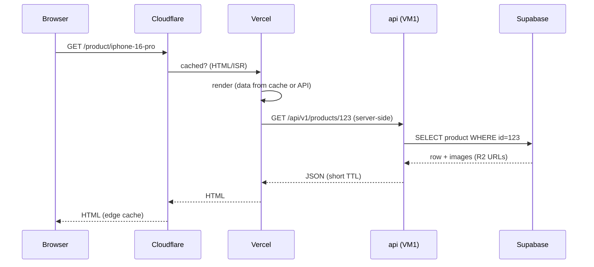
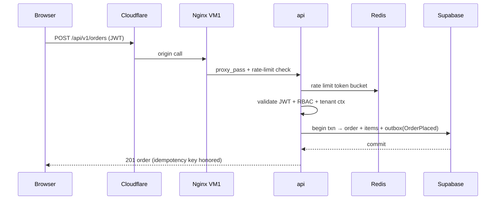
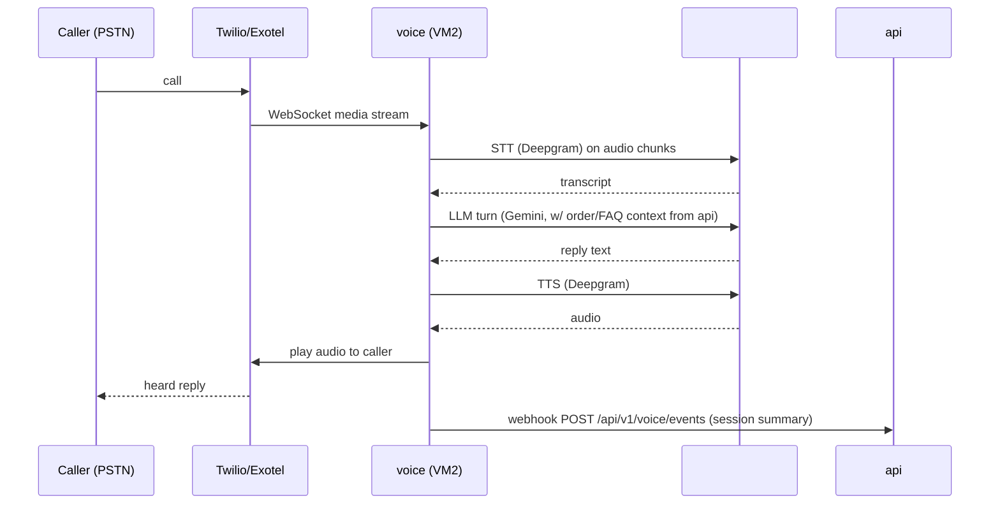

# 01 — Infrastructure & Network Architecture

## 1. Cloud topology

| Component | Provider | Purpose | Tier |
|---|---|---|---|
| Storefront | Vercel | Next.js SSR/ISR + edge serving | Free (Hobby) |
| Edge | Cloudflare | DNS, CDN, TLS, WAF, DDoS, edge rate-limit | Free |
| API origin | Oracle Cloud **VM1** (2 OCPU / 12 GB) | modular monolith API, workers, Redis, nginx | Always Free |
| AI/voice origin | Oracle Cloud **VM2** (1 OCPU / 6 GB) | , voice, nginx | Always Free |
| Database | Supabase | Postgres (shared schema, RLS, pgvector) | Free |
| Object storage | Cloudflare R2 | product/media images (S3-compatible) | Free tier |
| Object storage (alt) | Oracle Object Storage | second image backend (S3-compatible) | Free tier |
| Telephony | Twilio / Exotel | voice in/out (PSTN → WebSocket) | Usage |
| AI | Gemini / Groq / Deepgram / OpenRouter | LLM, embeddings, STT, TTS | Usage |

**Decision — two VMs + managed everything else.**

- **Why:** Oracle's Always-Free ARM (4 OCPU / 24 GB) is the best price/performance
  for a bootstrapped SaaS on earth right now. Managed pieces (Supabase, R2, Cloudflare,
  Vercel) remove the ops that would otherwise eat your week, for ₹0.
- **Alternatives:** Fly.io/Render/Railway (easy but not free at this scale); Hetzner
  VPS (great value, not free); all-on-one VPS including Postgres (you rejected this —
  correctly, see `04-database-design.md`); DigitalOcean (paid).
- **Trade-offs:** free tiers come with limits (Supabase 500 MB / 7-day pause; Vercel
  Hobby bandwidth; R2 ops caps). Mitigations are in `09-dr-backups-scaling-cost.md`.
- **Migration path:** nothing here is load-bearing. DSNs and API keys are config;
  providers are swappable behind adapters.

## 2. Network architecture

### 2.1 Public DNS

| Host | Target | Purpose |
|---|---|---|
| `emivo.com` (apex) | Vercel | storefront |
| `www.emivo.com` | Vercel | storefront |
| `api.emivo.com` | Nginx VM1 (origin) | backend API, workers admin, media |
| `voice.emivo.com` | Nginx VM2 (origin) | voice service,  |
| `ai.emivo.com` | Nginx VM2 (origin) |  (internal/customer-facing chat) |

All DNS at Cloudflare (proxy on = CDN/TLS/WAF in front of every host).

**Decision — one public hostname per VM, everything behind it.**
- **Why:** a single origin keeps nginx as the only public surface per VM; firewall and
  TLS are one place. No per-service public IPs, ever.
- **Alternatives:** public IP + port per service (bad: exposes internals, breaks TLS
  naming, kills the firewall story).
- **Trade-offs:** nginx becomes a single point of entry (acceptable — it is stateless,
  cheap, and restart-safe; Cloudflare is the first line anyway).
- **Migration path:** when you add VM3, add one more hostname (`api2.emivo.com`) and a
  Cloudflare load balancer in front of both — no app change.

### 2.2 Network zones (logical)

```text
[Internet]
   │
   ▼
[Cloudflare edge]            public zone — TLS, CDN, WAF, edge rate-limit
   │
   ├──► Vercel (storefront)
   │
   ▼
[Oracle VCN]                  cloud zone
   ├── Public subnet 1 ── VM1: nginx (443) ← ONLY public listener
   │        │                ├── api (127.0.0.1:8000)      docker-internal
   │        │                ├── workers (internal)        docker-internal
   │        │                └── redis (127.0.0.1:6379)    docker-internal
   │        └── egress only to Supabase, R2, Gemini, Groq, Deepgram, Twilio
   └── Public subnet 2 ── VM2: nginx (443)
            │                ├──  (127.0.0.1:8001)
            │                └── voice (127.0.0.1:8002)
            └── egress only to AI providers, telephony
```

### 2.3 Firewall (OCI security lists + iptables/nftables)

| Direction | Source | Dest | Port | Protocol | Purpose |
|---|---|---|---|---|---|
| Inbound | 0.0.0.0/0 | VM1 nginx | 443 | TCP | HTTPS (Cloudflare proxy IPs recommended) |
| Inbound | 0.0.0.0/0 | VM1 nginx | 80 | TCP | ACME/certbot challenge (optional, short-lived) |
| Inbound | 0.0.0.0/0 | VM2 nginx | 443 | TCP | HTTPS voice/ai |
| Inbound | blocked | any | 22 | TCP | SSH via **Bastion/Site-to-site or IP allow-list only** |
| Inbound | blocked | any | 8000/8001/8002/6379 | TCP | never public |
| Outbound | any | 443 | any | TCP | egress to managed services & AI providers |

**SSH hardening:** disable password auth; ed25519 keys; allow only your IP or use
OCI Bastion; fail2ban. GitHub Actions deploys via a **deploy-only key** that can run
only `docker compose` commands (see `08-cicd-and-deployment.md`).

**Decision — Cloudflare proxies the origin, so nginx should accept connections only
from Cloudflare IPs.**
- **Why:** hides the origin IP (a real DDoS target), and Cloudflare's IP set is
  published for your firewall. Origin IP should never appear in DNS.
- **Alternatives:** certbot Let's Encrypt with DNS-01 (works without port 80); plain
  origin-facing TLS.
- **Trade-offs:** if Cloudflare is down, the origin is unreachable (mitigate with a
  "grey-cloud / bypass" DNS toggle in emergencies; Cloudflare has ~100% uptime SLA).
- **Migration path:** the nginx layer is identical whether or not Cloudflare is in
  front — you can remove it and point DNS straight at the VM.

## 3. Traffic flows

### 3.1 Storefront (SSR/ISR) — the happy path



### 3.2 Client-side API (cart, checkout, account)



### 3.3 Voice call flow (VM2)



## 4. TLS strategy

- **Edge:** Cloudflare full(strict) TLS — certificate at edge, origin certs on nginx.
- **Origin:** one Let's Encrypt cert per VM via `certbot` or `acme.sh` with the
  **Cloudflare DNS-01 challenge** (no open port 80 needed). Auto-renewal cron.
- **Internal:** services on `127.0.0.1` / docker-internal network do **not** need TLS;
  nginx is the only TLS terminator.
- **DB:** Supabase is TLS always.

**Why full(strict):** Cloudflare validates the origin cert, so even if the edge is
bypassed the connection is authenticated. **Alternatives:** strict-only, flexible
(never — plaintext to origin). **Trade-offs:** you must manage origin certs
(certbot renew does it automatically).

## 5. Capacity & future headroom

| Metric | MVP load | VM1 | VM2 |
|---|---|---|---|
| Concurrent API users | few hundred | fine (4 uvicorn workers) | — |
| Requests/sec | ~10–30 peak | fine | — |
| AI calls/min | low | — | fine (thin proxy) |
| Media egress | catalog images | cached at edge | — |

Account headroom: **1 OCPU + 6 GB unused** → a free **VM3** for a second API tier or
Qdrant/Meilisearch. Full growth path in `09-dr-backups-scaling-cost.md` §3.

## 6. Decision summary

| Decision | Choice | Why | Migration path |
|---|---|---|---|
| Edge | Cloudflare free | ₹0 TLS/CDN/WAF/DDoS | removable; nginx independent |
| Public surface | one hostname per VM | firewall/TLS in one place | add LB hostnames later |
| TLS | Cloudflare strict + certbot DNS-01 | auto-renew, no open :80 | keep forever |
| SSH | keys + allow-list + deploy-only key | security | OCI Bastion later |
| Origin exposure | Cloudflare-only accept | hides origin IP | — |
