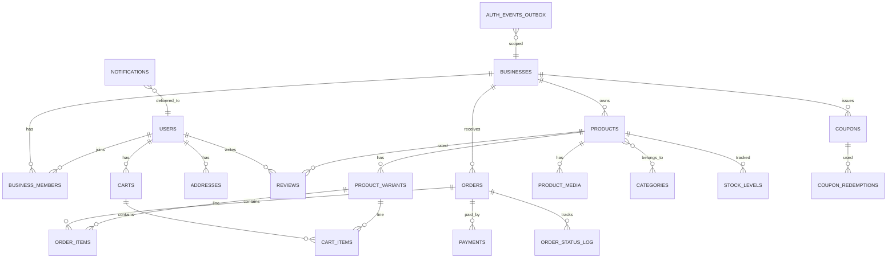

# 04 — Database Architecture

## 1. Multi-tenancy strategy: shared schema + `business_id` + RLS

```
Decision: SHARED tables + tenant discriminator + Row-Level Security.

  products (business_id, ...)
  orders   (business_id, ...)
  ...
  + Postgres RLS policy: business_id = current_setting('app.business_id')
```

**Why:** the standard for B2B multi-tenant SaaS at this scale.
- Cross-tenant features (platform-wide recommendations, admin reporting, search across
  stores) stay *single queries* instead of N-schema unions.
- One set of migrations, one backup, one schema to reason about.
- RLS gives **defense-in-depth at the database layer**: even if a bug forgets a
  `WHERE business_id = ?`, the policy blocks the row. This is your safety net, not
  your primary gate — the app layer still scopes every repository query.

**Alternatives & why rejected:**
- *Schema-per-tenant* (`tenant_001.products`): clean isolation, but 100 tenants =
  100 × every table, migration×100, and cross-tenant queries become app-level joins.
  Adopt only when a single tenant's row volume demands physical isolation.
- *Database-per-tenant*: even heavier; connection exhaustion at 100s of tenants.
- *Row-level only, no app scoping*: unsafe — a bug in one query leaks.

**Trade-offs:** shared tables need disciplined indexing (`business_id` leading); a
mis-set `app.business_id` affects everything (mitigated by the middleware always
setting it, and tests asserting it).

**Migration path (Phase 3+):** when a tenant (or the whole catalog) outgrows a shared
table:
- **Citus** `create_distributed_table('products', 'business_id')` shards by tenant —
  same schema, same SQL, mostly no code change.
- Or move hot tenants to dedicated schemas with a routing layer.
- Read-heavy scale: replica read-replicas (see `09`).

## 2. Connection strategy (Supabase specifics)

- **Connect over TLS** with `asyncpg` (SQLAlchemy async). Use the **pooled** Supabase
  (Supavisor) connection string in **session/transaction mode** with a small pool
  (5–10) — free tier caps direct connections (60) and pools around 200 connections
  total; async + pooling is what lets "few hundred concurrent users" share ~10 sockets.
- Set `pool_timeout`, `pool_pre_ping`, statement timeout, and a lock timeout.
- Use **one DSN for api + workers**; treat Supabase free's 500 MB as a *soft ceiling*
  to monitor (see cost doc).

**Why Supabase (agreed):** it is real Postgres 15+ with auth/storage/realtime built in
— but you use **only Postgres**. No GoTrue, no PostgREST, no Realtime. The app is the
only client. That keeps the exit path clean (plain SQL, plain driver).

**Alternatives:** Neon (serverless PG, generous free tier, branching — good Phase-2
upgrade), self-hosted on VM1 (rejected by you — agree: backup + memory + no SLA),
Managed Oracle Autonomous DB (free but Oracle-flavored — lock-in risk).

## 3. Core schema (mermaid ERD — high level)



### Key tables & columns (design notes)

| Table | Key columns | Notes |
|---|---|---|
| `businesses` | id, slug, name, plan, status, deleted_at | tenant root; `slug` unique per plan |
| `users` | id, email, phone, password_hash, status, deleted_at | platform-wide identity (customer + staff) |
| `business_members` | business_id, user_id, role | join; RBAC seat |
| `roles` / `permissions` | code, name | seeded: `platform_admin`, `owner`, `staff`, `customer` |
| `products` | business_id, sku, name, slug, description, price_cents, currency, status, image_url, deleted_at | **price stored as integer minor units**; `image_url` = any origin |
| `product_variants` | product_id, attributes(jsonb), price_cents, sku | colour/size/etc. |
| `product_media` | product_id, kind, url, sort | multiple images (R2/OCI/external) |
| `stock_levels` | product_id/variant_id, business_id, qty, reserved | separate from products → inventory sync |
| `orders` | business_id, user_id, number, status, totals, currency, placed_at | status machine: cart→created→paid→fulfilled→… |
| `order_items` | order_id, product_id, variant_id, qty, unit_price_cents | price snapshot (products change) |
| `payments` | order_id, provider, provider_ref, amount_cents, status | EMI: `emi_plan_id`, `tenure`, `installments` |
| `coupons` | business_id, code, type, value, min_cart, max_discount, valid_from/to, deleted_at | |
| `reviews` | product_id, business_id, user_id, rating, body, deleted_at | |
| `cart_items` | cart_id, variant_id, qty | hard-delete on expiry |
| `outbox_events` | aggregate_type, aggregate_id, event_type, payload, status, business_id | the event backbone |
| `audit_log` | actor_id, action, entity_type, entity_id, before/after jsonb, ip, request_id | see §6 |
| `product_embeddings` | product_id, embedding vector(1536), model, updated_at | pgvector; model name tracked for re-embed |

**Money = integer minor units (`price_cents`)**, never `float`. Currency on every
money column. EMI options (already a storefront feature) = `payments.emi_plan_id` +
`tenure` + per-installment split computed in the payments module.

**Images:** `products.image_url`, `product_media.url` hold **URLs only**. The storage
layer (`core/storage.py`) resolves R2, OCI, or external URLs; the DB never sees bytes.

## 4. Indexing strategy

| Pattern | Where | Why |
|---|---|---|
| Composite `(business_id, created_at DESC)` | every tenant table | tenant-scoped list queries |
| `(business_id, sku)` **partial unique** (`WHERE deleted_at IS NULL`) | products, variants | SKU reuse after soft-delete |
| `(business_id, status)` | orders, payments | status filters |
| GIN `tsvector` + `pg_trgm` | products.name/description | keyword search at MVP |
| GIN `jsonb` (`attributes`) | variants | attribute filters |
| HNSW/IVFFlat | `product_embeddings.embedding` | semantic search (pgvector) |
| `(order_id)` | order_items, payments | FK lookups |
| Hash on `business_id` | outbox, analytics | fan-out scans |

Add indexes **from the first migration** — you can't retrofit unique partial indexes
after dupes exist.

**Why these:** every query is either tenant-scoped (leading `business_id`) or an
aggregate (covered by composite indexes). The embedding index is created with
`CREATE INDEX ... USING hnsw (embedding vector_cosine_ops)`.

## 5. Foreign keys, constraints, enums

- **FKs with `ON DELETE` policy per table**: soft-deleted parents (products) keep
  children; hard-deleted transient parents (carts) cascade.
- **`CHECK` constraints** for money ≥ 0, rating 1–5, status values where an enum is
  overkill; use Postgres **enums** for status machines that are stable
  (`order.status`), and `jsonb` for anything that varies (variant attributes).
- **`NOT NULL`** on tenant discriminators (`business_id`) everywhere — a null
  `business_id` is a cross-tenant leak waiting to happen.
- **Deferrable unique constraints** where bulk import creates ordering problems.

## 6. Audit & soft deletes

### Audit
- `audit_log` written **app-side** by a service wrapper (has actor context, IP,
  request_id, and `before`/`after` JSON) — richer than DB triggers and
  request-correlated.
- DB **triggers** as a second layer only for the highest-sensitivity tables
  (products, orders, payments, businesses) capturing row-level changes even for
  writes that bypass the app (ad-hoc SQL).
- Retention: archive > 12 months to R2 (parquet) and prune.

### Soft deletes (challenged decision #8)
Soft-delete **only**: `users`, `businesses`, `products`, `orders`, `reviews`
(audit/legal/order-history integrity).
Hard-delete: `cart_items`, `sessions`, `otp_codes`, `coupon_redemptions` (transient),
and processed `outbox_events` (retention-windowed).
Every soft-delete table gets a **partial unique index**
(`WHERE deleted_at IS NULL`) so SKUs/emails are reusable after deletion.

**Why not soft-delete everything:** unique constraints become unusable, indexes bloat,
every query filters `deleted_at IS NULL`, and "I'll restore it later" is almost never
exercised. **Trade-offs:** hard-deleted data is unrecoverable — acceptable for
transient data; backed up for permanent data. **Migration path:** none needed; this
is the day-1 discipline.

## 7. Migrations (Alembic)

- `db/migrations/` — Alembic, **all schema changes are additive first** (expand) →
  deploy → **backfill/cleanup** (contract) — the expand/contract pattern that enables
  zero-downtime deploys (`08`).
- Migration policy: one PR = one migration file; migrations are reviewed like code;
  `down` revisions written and tested.
- **Idempotent RLS/trigger SQL** in `db/rls/` applied as a post-migration step
  (`rls.{up,down}.sql`), not inside Alembic's autogen (autogen can't see policies).
- **Seeding** in `db/seeds/` (roles, permissions, sample catalog) — deterministic,
  idempotent.

**Why expand/contract:** two `api` replicas run different code versions during a
rolling deploy; a migration that drops a column the old image still uses breaks the
roll. Additive migrations keep both versions safe. **Alternatives:** downtime deploys
(rejected), shadow reads (later, for hot tables). **Trade-offs:** some migrations are
two steps (add column + nullable, backfill, then tighten). **Migration path:**
identical process at Postgres scale.

## 8. RLS in practice

```sql
-- applied per tenant table, idempotently
ALTER TABLE products ENABLE ROW LEVEL SECURITY;

CREATE POLICY products_tenant_isolation ON products
  USING (business_id = current_setting('app.business_id', true)::uuid)
  WITH CHECK (business_id = current_setting('app.business_id', true)::uuid);

-- the app sets it per request in a transaction:
--   SELECT SET LOCAL app.business_id = :id  -- (true) = session-local, reset
```

- `app.business_id` is **session-local and reset per request/transaction** by the
  tenancy middleware; never global.
- RLS is a **safety net**; the app still scopes queries. Test that both layers agree
  (a test tries to read `business_id` from a different tenant and asserts 0 rows).
- Supabase's PostgREST/anon path is **not used**; the `service_role`/DB role is the
  app's role, so RLS policies are written for that role's session setting.

## 9. Vector data (pgvector now)

- `product_embeddings`: one row per (product_id, model) — regenerate on
  `ProductUpdated` (worker) and bump `model` when you change embedding models so old
  vectors are re-embedded, not mixed.
- Queries: `ORDER BY embedding <=> :query_vec LIMIT k` with optional
  `WHERE business_id = ... AND category = ...` (filters).
- **Interface:** search module's `VectorStore` protocol — Postgres impl now, Qdrant
  impl later (see `06`). Qdrant migration copies vectors + payload columns wholesale.

## 10. Supabase limits & exit path

| Free limit | Reality | Plan |
|---|---|---|
| 500 MB DB | fine for ~500 products + 100 businesses + orders | monitor; archive audit/analytics to R2 |
| Pauses after 7d inactivity | kills a production demo | scheduled keep-alive ping or upgrade when revenue exists |
| 60 direct conns / pooled | enough with async pool | raise when metrics demand |
| No PITR | backups = daily `pg_dump` → R2 (see `09`) | paid PITR later |

**Exit path (Phase 2, ~20k users or DB > 2 GB):**
1. `pg_dump` to **Neon** (serverless PG, branch previews, autoscaling) — same DSN
   driver, RLS intact, **zero app change**, or self-host with read replicas.
2. Keep plain SQL + `asyncpg` so the switch is a DSN edit + config, not a rewrite.

## 11. Decision summary

| Decision | Choice | Why | Migration path |
|---|---|---|---|
| Tenancy | shared schema + business_id + RLS | standard, cross-tenant queries | Citus / dedicated schema |
| DB provider | Supabase (PG only) | free real Postgres | Neon / self-host, DSN swap |
| Money | integer minor units | correctness | unchanged |
| Soft deletes | targeted + partial unique indexes | constraints stay usable | unchanged |
| Migrations | Alembic, expand/contract | zero-downtime safety | unchanged |
| Vectors | pgvector behind interface | zero infra now | Qdrant swap |
| Audit | app-level + triggers for critical tables | actor/IP/request context | unchanged |

