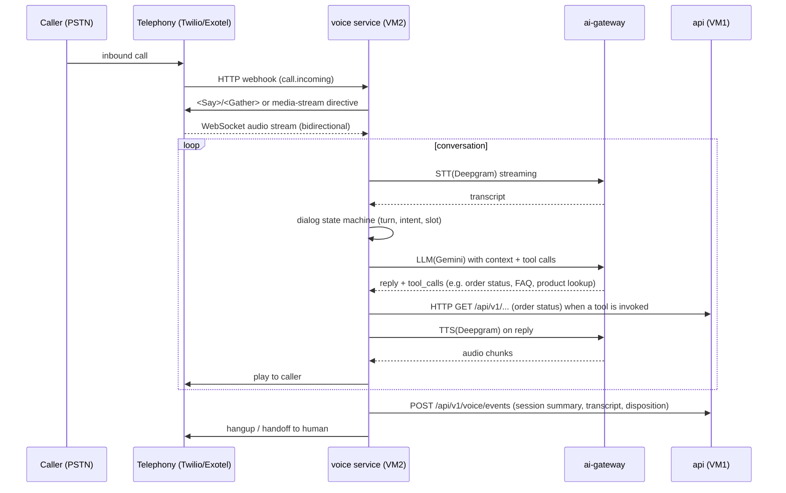

# 05 — AI & Voice Architecture

## 1. Principles (agreed with the brief)

- **No local inference, ever.** No Gemma/Llama/Ollama on the VMs. Models run on
  Gemini / Groq / Deepgram / OpenRouter. The VMs only orchestrate.
- **AI provider is config, not code.** Changing Gemini → Groq for chat is an env
  change, not an edit.
- **AI is a separate service** (`ai-gateway` on VM2), not a module inside the API.
- **Voice is separate** from the backend (its own service on VM2).

**Why a separate `ai-gateway` service instead of an `ai` module in the monolith:**
AI is the highest-churn, highest-variable-cost subsystem (new providers weekly, token
budgets, latency, retries). It is the *first* thing you'll want to scale independently,
A/B a provider, or throw a dedicated VM at. Separating it now means the API never
re-deploys when you tune prompts or switch providers — and it's the cleanest
illustration of the "module lifts out into a service" pattern.

**Trade-offs:** one more process, one more network hop for AI calls.
**Migration path:** none — it already *is* the microservice.

## 2. AI Gateway service (`apps/ai-gateway`)

### 2.1 Responsibilities

- **One internal API** for the monolith (and voice): `chat`, `embed`, `transcribe`,
  `synthesize`.
- **Provider routing**: per capability (LLM vs embeddings vs STT vs TTS), per
  model-tier, with **fallback chains** and **circuit breakers**.
- **Cost & token accounting**: every request → `ai_usage` row
  (tenant, feature, model, input/output tokens, cost-estimate, latency). This is how
  you bill AI usage to businesses later and keep your own spend visible.
- **Caching**: semantic cache in Redis (exact/similar prompt → cached reply) and
  embedding cache. This is the single biggest AI cost lever (see §5).
- **Prompt management**: versioned, reviewable prompts (not string constants
  scattered in code). Prompt-per-feature, prompt-per-tenant where needed.
- **Safety**: moderation hook, PII redaction, content policy, per-tenant token caps.

### 2.2 Provider abstraction

```python
# aigw/providers/base.py
class LLMProvider(Protocol):
    async def chat(self, req: ChatRequest) -> ChatResponse: ...

# aigw/providers/gemini.py / groq.py / openrouter.py
class GeminiProvider: ...
class GroqProvider: ...

# aigw/routing.py  — config-driven
CHAT_ROUTES = {
    "assistant": { "provider": "gemini",  "model": "gemini-2.0-flash",  "fallback": ["groq"] },
    "analytics": { "provider": "groq",    "model": "llama-3.3-70b",     "fallback": [] },
    "expensive": { "provider": "gemini",  "model": "gemini-2.5-pro",    "fallback": ["openrouter"] },
}
EMBEDDINGS = { "provider": "gemini", "model": "text-embedding-004" }
STT = { "provider": "deepgram", "model": "nova-2" }
TTS = { "provider": "deepgram", "model": "aura-2" }
```

Routing rules (in config, with sensible defaults):
- **Model tiering**: cheap/fast model for the default assistant; high-quality model
  only for explicit "deep" intents (analytics summarization, complex support).
- **Fallback chain**: primary → fallback on timeout/429/5xx (each provider is a
  `CircuitBreaker` in `core/`).
- **Retries with exponential backoff + jitter**, honoring provider rate limits.

### 2.3 API surface (internal)

```text
POST /v1/chat          { conversation_id, messages, tenant_id, feature } -> reply
POST /v1/embed         { texts[] }                                      -> vectors[]
POST /v1/transcribe    { audio_stream | audio_url, language }            -> text + confidence
POST /v1/synthesize    { text, voice }                                   -> audio (url or stream)
GET  /v1/usage?feature=…&tenant=…                                        -> cost/usage
```

Auth: **internal mTLS or a shared gateway API key**; the gateway is only reachable
from VM1 (and voice, same VM2). No public route.

### 2.4 Why these providers

| Capability | Provider | Why | Alternatives |
|---|---|---|---|
| LLM chat | Gemini (default) + Groq fallback | generous free tier, fast, strong reasoning; Groq = low-latency inference | OpenRouter (aggregator, good for rare models) |
| Embeddings | Gemini `text-embedding-004` | cheap, 768–3072 dims, solid retrieval | OpenAI, Cohere |
| STT | Deepgram | streaming, low-latency, accurate, good pricing | AssemblyAI, Whisper API |
| TTS | Deepgram Aura | fast, natural voices, SSML | ElevenLabs (better but pricier), Azure |
| Aggregator (future) | OpenRouter | one key to many models | — |

**Why not one provider for everything:** lock-in, price, and latency profiles differ
per capability. **Trade-offs:** managing several keys — amortized by the gateway's
centralized config. **Migration path:** adapters are config; adding a provider is
one class + one config block.

## 3. AI features & how they run

| Feature | Flow | Latency class |
|---|---|---|
| Storefront assistant (chat) | chat → (optional) RAG over product catalog via embeddings in `search` | interactive, streaming |
| Semantic search | `embed(query)` → vector → `VectorStore.query()` | ~50–200 ms |
| Product recommendations | embeddings + co-occurrence (offline in workers) → Redis | precomputed, instant |
| AI product descriptions | worker batch: `chat` per product → draft → review | async |
| Analytics summaries | worker: `chat` over aggregated events | async |
| Voice agent | STT→LLM→TTS real-time | streaming |

**RAG in the chat module:** the chat module calls `search` (semantic) for context
before/with the LLM call — documents stay in Postgres, retrieval is the search module;
the gateway never touches the catalog directly. Keeps data flow one-way and auditable.

## 4. Voice service (`apps/voice`, VM2)

### 4.1 Call flow



### 4.2 Design notes

- **`voice` is a state machine, not a chatbot.** Each call = a session
  (`VoiceSession`) with intent + slot state; the LLM fills slots via **tool/function
  calling** into the API's read endpoints (orders, products, FAQs) — never free-form
  SQL.
- **Streaming STT/TTS** via Deepgram WebSocket; the service buffers audio, not the
  whole call, in memory (long-call safety).
- **Interruptions/barge-in**: detect caller speech mid-TTS and cut synthesis.
- **Handoff**: on failure threshold or caller request, transfer to a human line;
  session context is passed in the handoff summary.
- **Recording**: store transcript + call summary to R2 (compliance), never raw audio
  by default.
- **Security**: the voice service talks to the API with a **service token** scoped to
  read endpoints; all AI traffic still funnels through the gateway (rate/cost limits).
- **Phone numbers**: Twilio or Exotel (Indian market — Exotel is strong there);
  number pool, per-number rate limiting, spam/DND handling for outbound.

**Why this shape:** real-time audio is latency-critical and bursty — isolating it on
VM2 means STT/TTS jitter never disturbs the commerce API, and the whole voice stack
can scale separately. **Trade-offs:** two services to operate. **Migration path:**
voice scales horizontally (more WebSocket workers) when concurrent calls grow.

## 5. AI cost control (the real budget lever)

Your only variable infra cost is AI tokens. These controls matter more than any other
part of the design:

1. **Model tiering** (config): default cheap model; expensive only on explicit
   "deep" features. A wrong default here is 10–50× cost.
2. **Semantic cache** in Redis: repeat/similar prompts (support FAQs, product
   questions) served from cache. Most storefront traffic is repeated.
3. **Embedding cache**: never re-embed unchanged products; recompute only on
   `ProductUpdated`.
4. **Prompt budget**: cap `max_tokens` per feature; trim context to the retrieved
   top-k documents; token-count logging per request.
5. **Per-tenant caps** (rate + monthly token budget) so one noisy tenant can't burn
   your bill.
6. **Batch cheap work**: AI product descriptions, analytics summaries, and
   recommendations run as **offline worker jobs** at low-rate windows, not in request
   path.
7. **Free tiers first**: Gemini free tier + Groq free tier + Deepgram credits cover a
   real MVP; upgrade per-feature only when usage demands.
8. **Log every token**: `ai_usage` table → dashboards → decide on real data, not fear.

## 6. Decision summary

| Decision | Choice | Why | Migration path |
|---|---|---|---|
| AI location | separate `ai-gateway` on VM2 | isolation, scale, config-driven | already a microservice |
| Provider abstraction | adapters + config routing | config-only provider changes | add adapters freely |
| Model tiering | cheap default, expensive opt-in | cost is your main variable | tune in config |
| Voice | state machine + tool-calling into API | safe, auditable, human handoff | scale horizontally |
| Media | transcripts→R2, raw audio opt-out | compliance + storage cost | unchanged |
| Cost | cache + tiering + per-tenant caps + logging | controls your bill | unchanged |

