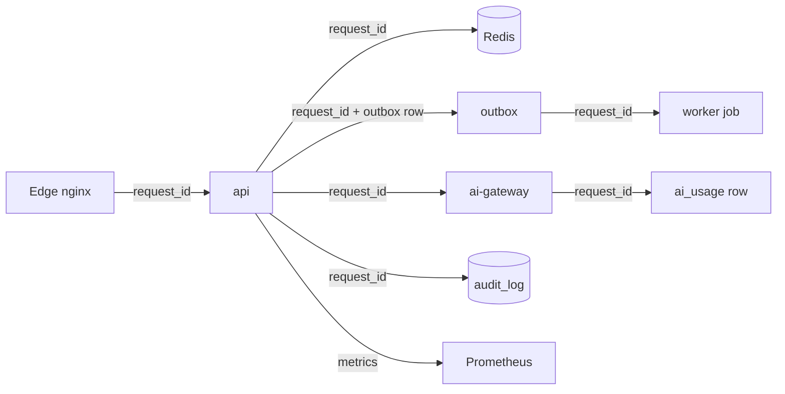

# 07 — Security & Observability Architecture

## Part A — Security

## 1. Authentication & session model

| Item | Design |
|---|---|
| Access token | **JWT** (short-lived, 15 min), signed HS256/EdDSA, claims: `sub`, `roles`, `business_id`, `iss`, `aud`, `exp`, `jti` |
| Refresh token | **Opaque**, 30 days, **rotating** (every refresh issues a new one and invalidates the old — reuse detection invalidates the whole family) |
| Refresh storage | hashed refresh token + `jti` denylist in **Redis** (logout + rotation) |
| OTP | 6-digit, TTL 5 min, `SHA-256`-hashed in Redis, max attempts/backoff, single-use |
| Password hashing | **argon2id** (or bcrypt cost-12) |
| Session | server-side session key in Redis for **long-lived logged-in devices** (optional: allows force-logout) |
| Cookies | `HttpOnly`, `Secure`, `SameSite=Lax` when used; API otherwise bearer-token |

**Why rotating refresh + denylist:** a stolen refresh token stops working at the next
rotation and can be force-revoked. **Alternatives:** pure stateless JWT refresh
(rejected: revocation is impossible), long-lived sessions only (rejected: worse
security posture). **Trade-offs:** a Redis dependency for auth (you already have it).
**Migration path:** swap Redis denylist → a dedicated session store or keycloak later
without touching the JWT contract.

## 2. RBAC & tenancy enforcement

```text
Roles (seeded):  platform_admin | owner | staff | customer
Permissions (per business): products.*, orders.read, inventory.write, reports, ...

Enforcement chain per request:
  1. JWT verified  →  identity claims
  2. Role → permission resolution (module `dependencies.py`)
  3. TenantContext.business_id set from JWT + path
  4. Repository layer ALWAYS filters by business_id
  5. RLS at DB is the last net (see 04 §8)
```

- Admin vs business roles are **separate realms**: `platform_admin` operates on any
  tenant (explicit, audited); business roles never cross tenants.
- Permission checks are a FastAPI dependency (`require_permission("orders.read")`),
  enforced in tests by a permission matrix test.

**Why this chain:** defense in depth — a missing check in one layer is caught by the
next. **Trade-offs:** slight ceremony per endpoint (a dependency call).
**Migration path:** the same permission model maps to OPA/policy-as-code later.

## 3. API security hardening

- **Rate limiting** — Redis token bucket, layered: per-IP (nginx + app), per-user,
  per-business, and **stricter on auth/OTP/payment endpoints**.
- **CORS** — allow only your Vercel origin(s) + admin app; `allow_credentials=true`
  only for the cookie path; no wildcards with credentials.
- **Input validation** — pydantic on every body/query; strict JSON; `max_length` on
  strings; pagination caps (≤100/page).
- **Idempotency keys** on mutations (orders, payments) — replays return stored
  responses.
- **Uploads** — size cap (5 MB), magic-byte content-type check, strip EXIF, upload to
  a *per-business prefix* in R2 with random keys (never user-controlled paths), serve
  via signed URLs for private media.
- **SSRF guard (challenged decision #12)** — the API accepts `image_url` pointing
  anywhere. If anything fetches a URL (image proxy, "fetch manufacturer image",
  webhook) it MUST:
  - allow-list schemes (`https` only) and top-level hosts;
  - **block private/link-local/metadata ranges** (`10/8, 172.16/12, 192.168/16,
    169.254.169.254, ::1, fd00::/8`) at both DNS-resolution and connect;
  - cap redirects and body size; never send cloud credentials.
- **Secrets** — env only; `config.py` refuses to start with missing secrets in prod;
  no secrets in code/logs/images; rotate provider keys via config change (no code).
- **Headers** — set by nginx (see `02`): HSTS, nosniff, X-Frame-Options, Referrer
  Policy, Permissions-Policy; CSP on the web app.
- **TLS everywhere**, and the DB/Redis never exposed publicly.

**Why an SSRF guard even though you "only store URLs":** stored URLs are fine; the
risk appears the first day you add an image proxy or an import tool. The guard is
cheap to build into the one `fetch_url` helper now.

## 4. Secrets lifecycle

| Stage | Handling |
|---|---|
| In repo | never; `.env*` gitignored; `sops` optional for team sharing |
| In CI | GitHub **Actions secrets** (encrypted) |
| On VM | `docker compose env_file: .env.prod` (permissions 600, owner root), not baked into images |
| In config | `pydantic-settings` + a boot-time check that prod secrets exist |
| Rotation | env change + `docker compose up` — no code |
| Vault later | OCI Vault / HashiCorp Vault behind the same `get_secret()` helper |

## 5. Compliance & data handling

- **PII** (email, phone, address): stored encrypted-at-rest by Supabase; masked in
  logs; export/deletion endpoints per business for DPA readiness.
- **Audit everything privileged** (admin ops, role changes, refunds) — `audit_log`.
- **AI data boundary**: prompts to providers exclude PII by default (redaction
  before send); provider DPA review before going paid; telemetry opt-out respected.

## Part B — Observability

## 6. Logging

- **Structured JSON** logs everywhere (`structlog` for API/workers/gateway/voice).
- **Request ID** (`X-Request-ID`) generated at the edge, honored through nginx → app
  → Redis → AI calls; outbox rows and `ai_usage` carry it too.
- **Log levels** via env; **no PII** in logs (mask emails/phones/addresses/tokens).
- Retention: docker `json-file` rotation (20 MB × 3) on the VM; the `audit_log` table
  holds durable audit; analytics events → Postgres/R2 archive.

**Why not a log-aggregator yet:** at this scale docker logs + grep + Sentry is
enough; a log service (Loki/Grafana Cloud) is a Phase-2 add when you have multiple
VMs. **Trade-offs:** no centralized search until then (acceptable).

## 7. Health & readiness

- **Per service:** `/health/live` (process up) and `/health/ready` (checks DB + Redis
  + outbox) — used by **Docker healthchecks**, nginx upstreams, and uptime monitors.
- nginx `/healthz` for load balancer / Cloudflare.
- System health: `node_exporter` → host metrics.

## 8. Metrics & monitoring (lean but real)

```text
Stack (Docker, VM1):  prometheus + grafana + node-exporter + redis-exporter
                      (+ nginx-exporter, app /metrics via prometheus-fastapi-instrumentator)
```

- **Dashboards (as code, in repo):** latency/error/throughput per endpoint,
  Redis hit-rate & memory, worker job duration/retries/DLQ, outbox lag, `ai_usage`
  cost per feature, DB pool & statement time.
- **Alert rules** (Alertmanager → email/Telegram/Discord webhook):
  - 5xx rate > 1% for 5 min · p95 latency > 1 s for 10 min
  - Redis memory > 80% of cap · disk > 80%
  - Worker heartbeat missing · outbox lag > 5 min
  - **Scheduled job stale** (last_run_at > 2× interval)
- **Error tracking:** **Sentry** free tier for API + web (source-mapped stack traces,
  release tags for correlation).
- **Uptime:** Uptime Kuma (or Cloudflare healthchecks) hitting `/healthz` per host.

**Why Prometheus+Grafana on a free VM instead of a SaaS:** free, full control, and
~400 MB is affordable. **Alternatives:** Grafana Cloud free (10k series — fine too),
VictoriaMetrics (lighter). **Trade-offs:** you operate the stack — containerized, it
is low-touch. **Migration path:** dashboards/alerts export to Grafana Cloud; exporters
are standard.

## 9. Correlation & the full picture



Every hop carries `request_id`; a support ticket "my order failed" is traceable from
the edge through the DB txn, the outbox event, the worker job, and the AI call that
may have been involved. **This is the single highest-value observability investment.**

## 10. Decision summary

| Decision | Choice | Why | Migration path |
|---|---|---|---|
| Auth | JWT 15m + rotating refresh + Redis denylist | revocable, secure | keycloak/store swap |
| Authorization | RBAC permissions + tenant ctx + RLS | defense in depth | OPA later |
| Uploads/URLs | validated + SSRF-guarded fetcher | prevents the day-1 leak | unchanged |
| Secrets | env + gitignored + Actions secrets | simplest safe default | Vault behind helper |
| Logging | structlog JSON + request IDs | correlation | Loki/cloud later |
| Metrics | Prometheus+Grafana self-hosted | free + controllable | Grafana Cloud export |
| Errors/uptime | Sentry + Uptime Kuma | cheap, effective | unchanged |

